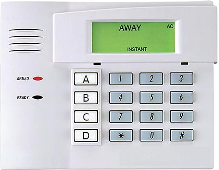
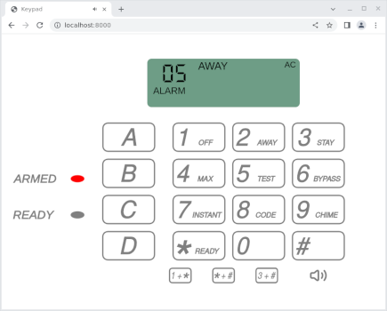
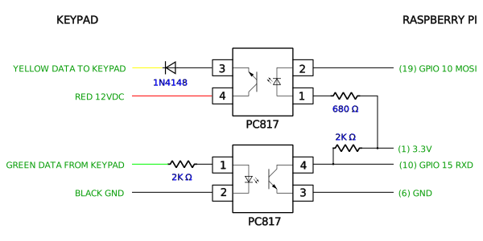
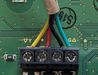
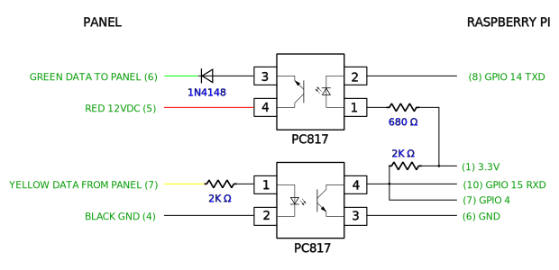
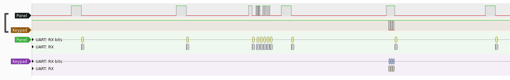
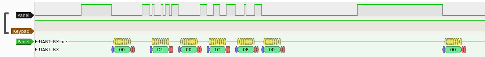
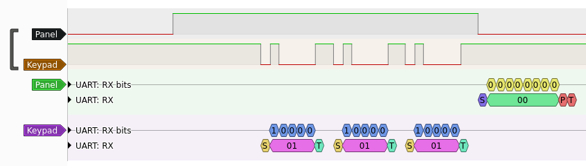
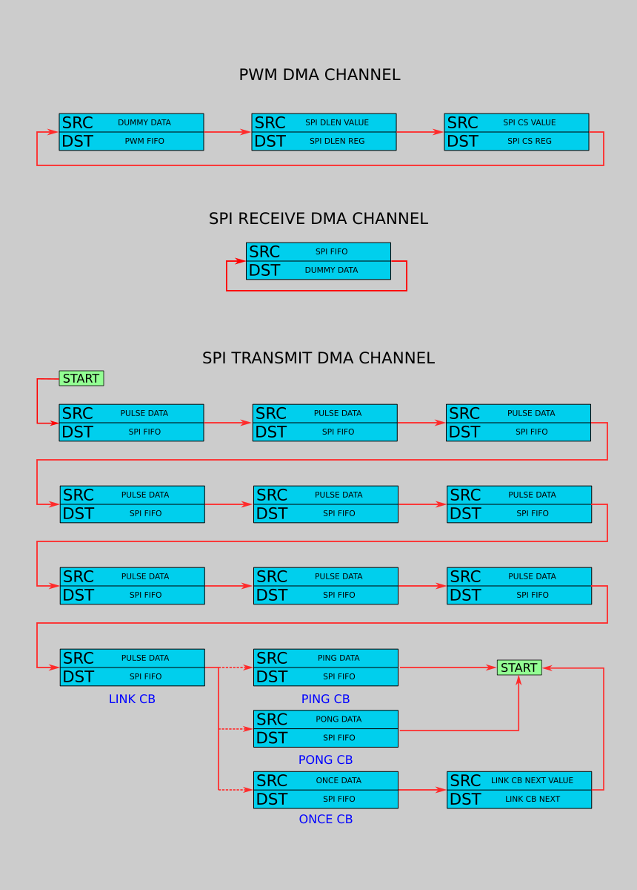

# Raspberry Pi interface to Honeywell Ademco 6150 keypad and panels

This project allows the Raspberry Pi to either communicate with or emulate
a Honeywell Ademco 6150 fixed display keypad in *non-addressable* mode with
the keypad address set to 31.  Note that the *non-addressable* mode is
different from the more modern ECP mode used when the keypad address is
something other than 31.




## Hardware

The Raspberry Pi is connected to either the keypad or the panel as depicted
in the appropriate schematic below. Optocouplers are used for isolation and
to shift the voltages and invert the signals.

### Keypad connection



The 6150 keypad uses a 4 wire interface:



| Keypad | Control Panel | Wire Color |
| :-: | :-: |:-: |
| &#9650; G | Data In (From Keypad) | Green |
| &minus; | &minus; Aux Pwr (GND) | Black |
| &plus; | &plus; Aux Pwr (12vdc) | Red |
| &#9660; Y | Data Out (To Keypad) | Yellow |

### Panel connection



## Quick start

### Raspberry Pi to keypad

The keypad address must be set to 31.  To set the keypad address, press the
[1] and [3] keys within 60 seconds of powering on the keypad.  Enter [0]
[0] to clear the current address and then enter [3] [1] [*] to set the
address to 31.

`pi2keypad` listens for commands on the specified UDP port.  Key presses
will sent back.  A command can be a sequence of either 4 or 8 bytes.  The 4
byte sequence will cause that [keypad message](#data-sent-to-the-keypad) to
be sent to the keypad continuously.  The 8 byte sequence will cause the
first 4 byte message to be sent once to the keypad and then the second 4
byte message to be sent continuously.

Compilation and execution:
```
gcc -Wall -O3 -o pi2keypad pi2keypad.c
sudo ./pi2keypad 1234 &
```

Display AWAY, INSTANT and AC with a red led.  Key press values will be
echoed on standard out:
```
printf "\x00\x00\x0c\x8c" | socat -t 999 udp:localhost:1234 - | hexdump -v -e '/1 "%02x\n"'
```

Beep 3 times and display AC with a green led.  Key press values will be
echoed on standard out:
```
printf "\x00\x03\x1c\x08\x00\x00\x1c\x08" | socat -t 999 udp:localhost:1234 - | hexdump -v -e '/1 "%02x\n"'
```

### Raspberry Pi to panel

`pi2panel` listens for 1 byte [key press
messages](#data-received-from-the-keypad) on the specified UDP port.  4
byte [keypad status messages](#data-sent-to-the-keypad) are sent back.  The
client connection will timeout if a key press message is not received every
60 seconds.  The special key press message `0xff` can be used as a
keepalive.

Compilation and execution:
```
gcc -Wall -O3 -o pi2panel pi2panel.c
sudo ./pi2panel 1234 &
```

Send the keepalive message and echo keypad status messages on standard out
for 60 seconds:

```
printf "\xff" | socat -t 999 udp:localhost:1234 - | hexdump -v -e '4/1 "%02x "' -e '"\n"'
```

Arm the panel using the master security code `1234` and echo keypad status
messages on standard out for 60 seconds:

```
printf "\x01\x02\x03\x04\x02" | socat -t 999 udp:localhost:1234 - | hexdump -v -e '4/1 "%02x "' -e '"\n"'
```

`keypad` provides a web-based UI for the keypad.  Its arguments are the TCP
ports to use for the HTTP and WebSocket connections and the hostname and
port of the pi2panel server:

```
./keypad 8000 8001 localhost:1234
```

Then connect to the keypad in a web browser using the url
`http://localhost:8000`.

`keypad` may be run on a host other than the Raspberry Pi.

## Protocol

A [HiLetgo USB Logic Analyzer](https://www.amazon.com/dp/B077LSG5P2) and
[PulseView](https://sigrok.org/wiki/PulseView) were used to analyze the
protocol.

The keypad expects to receive a 17ms sync pulse every 176ms.  Data for the
keypad is sent between the pulses.  A data packet consists of a 6ms high
pulse followed by 6ms low then 4 bytes of 2400 baud 8 bit even parity data.
Each byte is preceded by a 1ms pulse.  There's a final 1ms pulse after the
last byte.

The keypad transmits key presses during the 17ms sync pulse.  Each press is
sent as 3 bytes of 2400 baud 5 bit even parity data.  The 3 bytes
contain the same value and indicate the key (or key combination) that was
pressed.

The traces below are from the Pi's perspective and are the inverse of what
the keypad actually transmits and receives.



This trace shows the 17ms sync pulses within the 176ms frames.  One frame
contains data sent to the keypad from the panel and another has data sent
from the keypad to the panel.

### Data sent to the keypad



Here, the panel has sent the data `d1 00 1c 08`.  The initial `00` is due
to the 6ms pulse.  The final `00` is due to the 1ms pulse at the end of the
data.  The 17ms sync pulse also produces a `00` byte.

Data sent to the keypad controls the keypad beeps/tones, leds and displayed
status.  The control data consists of 4 bytes:

#### Byte 0 - hex display

| Bit | Description |
| :-: | ----------- |
| 0-7 | 2 digit hex display (00-EF, F1, FC) |
|     | F0, F2-FB, FD-FF cause the entire message to be ignored |

#### Byte 1 - beep control and status

| Bit | Description |
| :-: | ----------- |
| 0-2 | beep control (see table below) |
|  3  | increase beep n times volume |
|  4  | NIGHT |
|  5  | CANCELED |
|  6  | fast beeping (bits 0-3 must be 0) |
|     | suppresses all status/leds - displays 1C |
|  7  | ? |

| Beep Control Value | Description |
|  :-:  | ----------- |
|  0-3  | beep ***n*** times |
|   4   | fast beeping |
|  5-6  | 2 slow beeps |
|   7   | continuous beep |

#### Byte 2 - beep and status

| Bit | Description |
| :-: | ----------- |
|  0  | 3 slow beeps |
|  1  | CHECK |
|  2  | disable low digit |
|  3  | disable high digit |
|  4  | green (READY) led |
|  5  | FIRE |
|  6  | BAT |
|  7  | STAY/red (ARMED) led |

#### Byte 3 - tone and status

| Bit | Description |
| :-: | ----------- |
|  0  | oscillating tones |
|  1  | ALARM |
|  2  | AWAY/red (ARMED) led |
|  3  | AC (disable NO AC) |
|  4  | BYPASS |
|  5  | CHIME |
|  6  | disable NOT READY |
|  7  | INSTANT |

The `NOT READY` status will be displayed unless the red (ARMED) or green
(READY) led is on or the ALARM bit, CHECK bit or disable NOT READY bit is
set.

### Data received from the keypad



In this trace the keypad is sending key press data during the 17ms sync pulse.

The keypad sends 3 bytes of data to indicate a key press.  The bytes
all contain the same value and indicate the key (or key combination) that
was pressed.  The function keys (A - D) need to be held for 2 seconds.
The keys and their associated values (in hex) are:

|  Key  | Value |
|  :-:  | ----- |
|   0   |  00   |
|   1   |  01   |
|   2   |  02   |
|   3   |  03   |
|   4   |  04   |
|   5   |  05   |
|   6   |  06   |
|   7   |  07   |
|   8   |  08   |
|   9   |  09   |
|   *   |  0a   |
|   #   |  0b   |
| 1 + * |  0c   |
| * + # |  0d   |
| 3 + # |  0e   |
|   A   |  1c   |
|   B   |  1d   |
|   C   |  1e   |
|   D   |  1f   |

## Implementation

### Pi to keypad

Receiving from the keypad uses the UART set to 2400 baud, 5 data bits, even
parity 1 stop bit.

It was not possible to use the UART for transmission to the keypad due to
the sync pulses and other timing requirements.  Because Linux is not a
realtime operating system the lack of consistent timing prevented
bit-banging the sync pulses and serial data from working.  Fortunately, the
Raspberry Pi has a built-in device that can send an arbitrary serial bit
stream with rigid timing - SPI.

To avoid the non-realtime OS issues, the SPI device is fed using DMA.  The
SPI DMA is triggered by the PWM device.

Access to the peripherals is provided via `/dev/mem` and the `mmap()`
function.

Thanks to [Jeremy Bentham](https://iosoft.blog) for his articles on
[Raspberry Pi DMA programming in
C](https://iosoft.blog/2020/05/25/raspberry-pi-dma-programming) and
[Streaming analog data from a
Raspberry Pi](https://iosoft.blog/2020/11/16/streaming-analog-data-raspberry-pi).

Additional information came from the [BCM2835 ARM
Peripherals document](https://www.raspberrypi.org/app/uploads/2012/02/BCM2835-ARM-Peripherals.pdf) and its [errata](https://elinux.org/BCM2835_datasheet_errata).
Information on the PWM clocks came from [BCM2835 Audio Clocks](https://www.scribd.com/doc/127599939/BCM2835-Audio-clocks).

The minimum SPI frequency is greater than 2400 kHz so the SPI clock is set
to 4800 kHz and the bits in the keypad message are doubled to produce 2400
baud.

#### DMA Configuration

All the memory used for DMA is allocated uncached using the VideoCore
graphics processor
[mailbox](https://github.com/raspberrypi/firmware/wiki/Mailbox-property-interface)
interface.

The DMA controller is driven by *Control Block* (CB) structures.  The CBs may
be linked to form a chain of DMA requests.

3 DMA channels are used:

* PWM request to trigger the SPI operation
* SPI receive
* SPI transmit

The PWM device is configured to request a DMA operation every 176ms.  3 CBs
are chained to:

* feed dummy data to the PWM device
* write the SPI DLEN register
* write the SPI CS register to trigger the SPI operation

The SPI receive DMA channel has a single CB that reads (and throws away)
data from the SPI FIFO.

The SPI transmit DMA channel is where most of the work happens.  There are
2 types of frames that are being sent.  One has the 17ms sync pulse and no
other data.  The other has the 17ms sync pulse and the 4 bytes of data for
the keypad.  The frame with the keypad data is sent every 11th frame.  So
there are 10 frames containing just the sync pulse and the 11th contains
the sync pulse and the keypad data.

To prevent potential glitches when updating the keypad data, two
*ping-pong* buffers are used for the data.  One buffer contains the
currently active data.  When the data needs to change, the inactive buffer
is updated and then swapped in to become active.

The 10th DMA CB (**LINK CB**) points to a CB that will copy a frame
containing the sync pulse and keypad data.  To swap in the new keypad data
the next field of the **LINK CB** is altered to point to the appropriate
**PING** or **PONG** CB.

To send a particular keypad message once and then send another message
continuously, the one-time message is written to the *once* buffer and the
continuous message is written to the inactive *ping* or *pong* buffer.
Then the **LINK CB** next value is pointed to the appropriate **PING** or
**PONG CB**.  That value gets written to the **LINK CB** field by the CB
linked from the **ONCE CB**.

Graphically, the DMA channel configuration looks like this:



### Pi to panel

The UART is used for transmission to and reception from the panel.  One
GPIO pin is also connected to the received data to detect the frame sync
pulses.

To transmit a key press, a GPIO interrupt is configured to trigger on the
rising edge of the received data.  The frame sync pulse is detected by
looking for a rising edge that occurs after about a frame width (176ms)
from the previous rising edge.  Once the sync pulse is detected the UART is
configured for 5-bit data and the key press data is sent.  Then the UART is
restored to 8-bit data.

The keypad status data is read from the UART with the extraneous zero bytes
caused by the sync pulses discarded.

## License

_Licensed under the MIT License, Copyright (c) 2023 Greg Renda_
